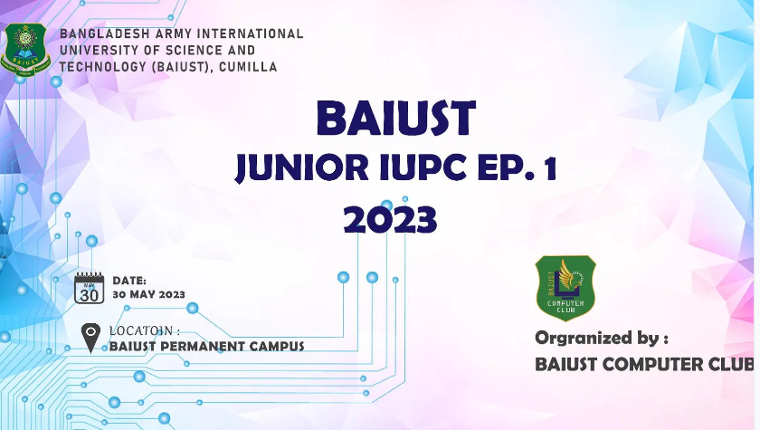

 

###  Story

>**Previously I had experience of solving problems on various online judges and participating in online & onsite coding competitions.**   
**In 2023 we had an Intra University programming competition organized by our computer club. Our faculty proposed the students having onsite coding competition experience should set a few problems in this contest.**    
**I had the opportunity to set 2 problems in the contest and experience the problem setting process.**  

##  📌Links
**You will find the contest link [Here](https://toph.co/arena?practice=64765afcd47a320767c000cf#!/p/6473fe50d47a320767bfcdb8)**

- **Problems**
    - **Save Money**
    - **Evenly Divisible**

 

##  [ Resources]()
- [**Problem Statements**](https://github.com/khalid586/Problem-Setting/tree/main/Problem%20statements)
- [**Test Cases**](https://github.com/khalid586/Problem-Setting/tree/main/Test%20cases)
- [**Solutions**](https://github.com/khalid586/Problem-Setting/tree/main/Solutions)

##  [ Editorial]()
- **You will get the Editorial** [**Here**](https://github.com/khalid586/Problem-Setting/tree/main/Solutions)
